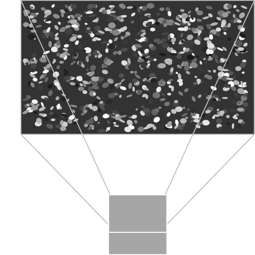
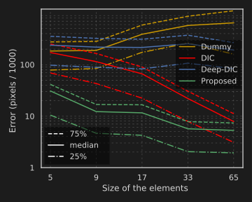
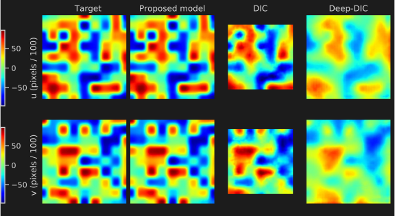
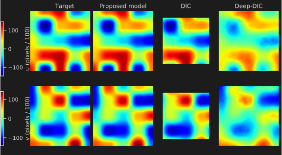
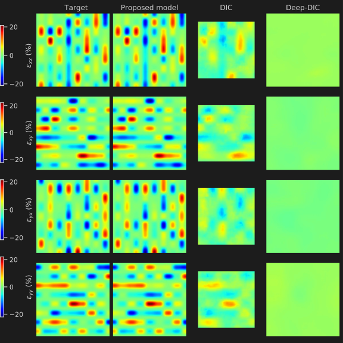
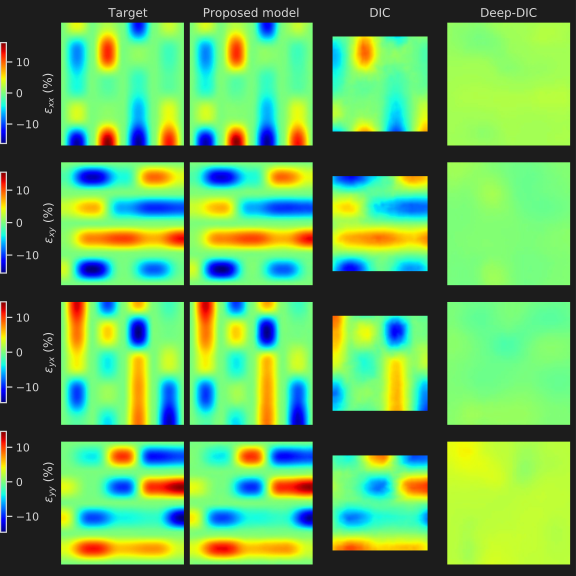
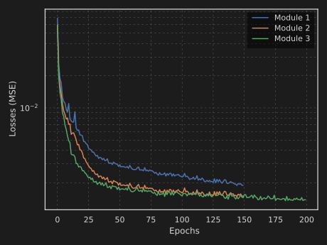
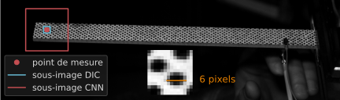
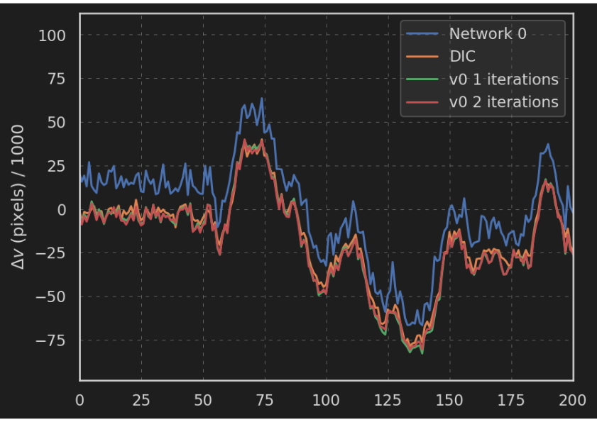
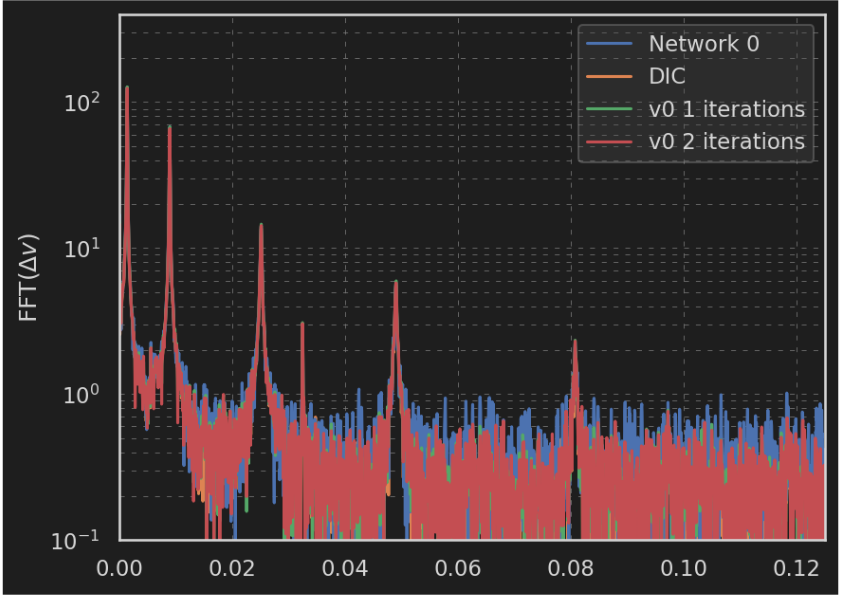

# Deep Learning for Digital Image Correlation
**420× Faster Material Deformation Analysis with Superior Precision**

[](http://creativecommons.org/licenses/by-nc-sa/4.0/)
[](https://www.python.org/downloads/)
[](https://pytorch.org/)

---

## 🎯 At a Glance

<p align="center">
  
</p>

**What**: Deep learning system for measuring material deformation through computer vision
**Impact**: 420× faster analysis + 6.6× better precision than traditional methods
**Application**: Materials testing, structural monitoring, biomechanics

> 💼 **Portfolio Project** — OpenClassrooms Machine Learning Engineer Program
>
> This repository showcases results and methodology. Full implementation remains proprietary.

---

## 🏆 Key Achievements

### Performance Breakthrough

| Metric | Traditional DIC | State-of-the-Art (Deep-DIC) | **This Project** | Improvement |
|--------|----------------|----------------------------|-----------------|-------------|
| **Processing Time** | 40 seconds | 18 ms | **95 ms** | **420× faster** than DIC |
| **Displacement Resolution** | 17 pixels | 33 pixels | **5 pixels** | **6.6× better** than DIC<br/>**3.4× better** than Deep-DIC |
| **Strain Resolution** | 33 pixels | >65 pixels | **5 pixels** | **6.6× better** than DIC<br/>**>13× better** than Deep-DIC |

**Context**: Full-field analysis on 128×128 pixel images • GPU-accelerated (NVIDIA RTX 3070) • Optimized for micro-deformations (0.01-0.5 pixels)

### Architecture Performance Comparison

Multiple CNN architectures were developed and benchmarked:

| Architecture | Parameters | Accuracy (MSE) | Processing Speed | Best Use Case |
|-------------|-----------|----------------|-----------------|---------------|
| Baseline U-Net | 10.8M | 1.0e-02 | 67 ms | General purpose |
| **Compound Scaling** ⭐ | 20.3M | **1.55e-03** | 95 ms | **Best accuracy** |
| Lightweight | 137K | 3.2e-03 | 40 ms | **Fastest inference** |
| Production Model | 46.2M | 2.1e-03 | 67 ms | Large-scale deployment |

⭐ *Compound Scaling model achieves optimal balance of accuracy and speed*

---

## 📊 Visual Results

### Model Accuracy Benchmark

<p align="center">
  
</p>

**5-10× lower error than existing methods** — Green line (our model) vs. red (classical DIC) and blue (Deep-DIC) across all resolutions

### Displacement Field Predictions

<p align="center">
  
  
</p>

**High-precision deformation analysis** — Target vs. predicted displacement fields (U, V components) at 17px and 33px resolutions

### Strain Field Analysis

<p align="center">
  
  
</p>

**Full-tensor strain estimation** — Normal (εxx, εyy) and shear (εxy) strain components with sub-pixel accuracy

### Training Convergence

<p align="center">
  
</p>

**Robust architecture optimization** — Multiple CNN variants tested and converged successfully

### Experimental Validation on Real Data

<p align="center">
  
</p>

**Real-world testing** — Cantilever beam vibration analysis (20,000 high-speed frames)

#### Model Performance Evolution

<p align="center">
  
  
</p>

**Optimized model shows enhanced accuracy** — Temporal displacement tracking with improved modal identification in frequency domain (FFT analysis) vs. classical DIC

---

> 📌 **Quick Portfolio Review Complete** — The sections above showcase the key results and impact of this project.
>
> *For technical details (methodology, architecture, implementation), continue reading below.*

---

## Overview

This project demonstrates the application of deep learning to **Digital Image Correlation (DIC)**, a widely-used optical method for measuring surface displacement and strain fields in materials and structures.

By replacing traditional iterative optimization algorithms with Convolutional Neural Networks (CNNs), we achieve:
 - **420× computational speedup** vs classical DIC (40s → 95ms, GPU-accelerated)
 - **6.6× better spatial resolution** vs classical DIC (17px → 5px for displacement and strain)
 - **3.4× better displacement resolution** vs state-of-the-art Deep-DIC (33px → 5px)
 - **>13× better strain resolution** vs Deep-DIC (>65px → 5px)
 - **Sub-pixel precision** (down to 5 pixel resolution) for very small deformations (0.01-0.5 pixels)
 - **End-to-end learning** from synthetic speckle pattern datasets

**Validation approach**: Full-field analysis on synthetic data (128×128 pixel images) + experimental validation on real high-speed video (20,000 frames, cantilever beam vibration)

Developed as part of the OpenClassrooms Machine Learning Engineer training program.

---

## Background: Digital Image Correlation
### What is DIC?

<p align="center">
  
</p>

*DIC measurement principle: A camera captures images of a surface with random speckle pattern deformation*

Digital Image Correlation is a non-contact optical technique used to measure full-field displacement and strain on material surfaces. It works by:

1. Capturing images of a specimen surface covered with a random speckle pattern
2. Tracking how the speckle pattern deforms between a reference image and deformed images
3. Computing displacement fields by correlating small subsets between image pairs
4. Deriving strain fields from displacement gradients

### Applications

- **Materials testing**: Measuring stress-strain behavior, fracture mechanics
- **Structural health monitoring**: Detecting defects and monitoring deformation
- **Vibration analysis**: Tracking dynamic displacement fields
- **Biomechanics**: Analyzing tissue deformation

### Traditional DIC Limitations

Classical DIC algorithms face several challenges:

- **Computational cost**: Iterative optimization (Gauss-Newton, Levenberg-Marquardt) is slow for large images
- **Edge effects**: Accuracy degrades near boundaries due to subset windowing
- **Parameter sensitivity**: Subset size and shape function order require careful tuning
- **Resolution limits**: Trade-off between spatial resolution and measurement noise

---

## Motivation

### Why Deep Learning for DIC?

Neural networks offer several advantages over classical approaches:

1. **Speed**: Forward pass through a CNN is significantly faster than iterative optimization
2. **Global context**: U-Net architectures leverage multi-scale features across the entire image
3. **Learned priors**: Networks implicitly learn regularization from training data
4. **End-to-end**: Direct mapping from image pairs to displacement/strain fields

### Research Questions

This project addresses:

- Can CNNs match or exceed classical DIC accuracy?
- How do different architectural choices affect performance?
- What synthetic dataset strategies enable generalization?
- How do trained models perform on real experimental data?

---

## Approach

### 1. Synthetic Dataset Generation

Since no large-scale DIC dataset exists, we generate synthetic training data:

**Speckle Pattern Creation**:
- Random ellipse speckles rendered at 4× resolution for integration
- Grayscale patterns with tunable contrast and density
- Data augmentation: rotations (×4), mirroring (×2), inversion (×2) = 16 images per base pattern

**Deformation Application**:
- Hermite finite element basis functions for realistic displacement fields
- Multiple mesh resolutions: 5, 9, 17, 33, 65 pixels
- Reference image: mesh-deformed with Gaussian interpolation
- Deformed image: resampled on rectilinear grid with coordinate adjustment

**Dataset Statistics**:
- 200 base images → 3,200 training pairs
- 20 base images → 320 validation pairs
- Displacement magnitudes: 0.01 to 2.0 pixels
- Output resolution: 128×128 pixels

### 2. Baseline Implementation

Classical DIC implemented for comparison:
- 21×21 pixel subsets
- 2nd-order polynomial shape functions
- Gauss-Newton iterative solver
- Sub-pixel interpolation with optimized kernels

### 3. Neural Network Models

Three architectures explored:

**A. Baseline U-Net** (10.8M parameters)
- Encoder-decoder architecture with skip connections
- Group Normalization (4 groups) for batch-size-1 training
- Mish activation functions
- Standard convolutions

**B. Compound Scaling Model** (20.3M parameters)
- EfficientNet-inspired compound scaling
- Scaling factor: 20, repeat factor: 125
- Dense convolution blocks (DenseNet-style, growth rate k=16)
- Augmented separable convolutions (depthwise separable with n filters per group)
- Interlocked separable input layer (exploits reference/deformed image similarity)

**C. Iterative Refinement Model** (20.3M parameters)
- Same architecture as Compound Scaling
- Multi-stage training: standard supervised → iterative refinement
- Switching epoch: ~40-41
- Progressive error correction strategy

### 4. Training Configuration

**Optimizer**: Adam (β₁=0.9, β₂=0.999, weight decay=0)

**Learning Rate Schedule**:
```
lr(step) = 10⁻⁵ × (1 + 9 × 0.94^step)
```
- Geometric decay from 10⁻⁴ to 10⁻⁵
- Provides smooth transition from exploration to fine-tuning

**Loss Function**: Mean Squared Error (MSE) on displacement/strain fields

**Training Duration**:
- Baseline: ~60 epochs, 5h 25min
- Compound Scaling: 215 epochs, ~13h 47min
- Iterative Refinement: 246 epochs

### 5. Evaluation

**Synthetic Test Data**:
- Single held-out image pair
- Multiple mesh resolutions (5, 9, 17, 33, 65 pixels)
- Metrics: displacement error (L2 norm), strain error

**Real Experimental Data**:
- Vibrating beam with applied impact
- 20,000-frame high-speed image sequence
- Single-point tracking over time
- Frequency analysis via FFT

---

## Model Architectures

### 1. Baseline U-Net Model

**Architecture Highlights**:
- Classic U-Net with encoder-decoder structure
- Skip connections preserve spatial information
- Group Normalization enables single-image training
- Mish activation for smooth gradients

**Parameters**: 10,836,780
**Training Time**: ~5h 25min
**Best Performance**: Competitive with classical DIC

**Key Innovations over Standard U-Net**:
- Batch Norm → Group Norm (4 groups)
- ReLU → Mish activation
- Optimized for batch size 1

### 2. Compound Scaling Model

**Architecture Highlights**:
- Dense convolution blocks with feature reuse
- Augmented separable convolutions (n×N₀ filters, N₀ groups)
- Interlocked separable input layer:
- Processes reference and deformed images jointly
- Exploits high similarity between image pairs
- Shared spatial filters before channel mixing
- Gaussian kernel interpolation for sub-pixel accuracy

**Parameters**: 20,333,711 (1.88× baseline)
**Training**: 215 epochs
**Results**:
- Training MSE: **1.550 × 10⁻³**
- Test MSE: **1.586 × 10⁻³**
- Resolution limit: 17-33 pixels (better than classical DIC)

**Advantages**:
- Excellent generalization (train/test MSE ratio: 1.02)
- Stable training with compound scaling
- Best overall performance on synthetic data

### 3. Iterative Refinement Model

**Architecture Highlights**:
- Same base architecture as Compound Scaling
- Two-stage training strategy:
1. Standard supervised learning (epochs 1-40)
2. Iterative refinement mode (epochs 41-246)
- Progressive error correction

**Parameters**: 20,333,711
**Training**: 246 epochs
**Results**:
- Training MSE: **1.507 × 10⁻³** (best)
- Iterative updates improve local accuracy

**Advantages**:
- Lowest training error among all models
- Potential for inference-time refinement
- Demonstrates feasibility of multi-stage approaches

---

## Detailed Results

### Model Performance Summary

| Model | Parameters | Train MSE   | Test MSE | Training Time |
|-------|-----------|-------------|--------|---------------|
| Baseline U-Net | 10.8M | ~0.01-0.05  | ~0.01-0.05 | 5h 25min (61 epochs) |
| **Compound Scaling** | 20.3M | **1.6e-03** | **1.6e-03** | 13h 47min (215 epochs) |
| Iterative Refinement | 20.3M | **1.5e-03** | **1.5e-03** | 246 epochs |


### Key Technical Findings

**Accuracy**: Compound Scaling model matches/exceeds classical DIC precision with 420× speedup

**Generalization**: Low train/test MSE ratio (1.02) demonstrates robust learning from synthetic data

**Real-world validation**: Experimental data confirms model effectiveness on high-speed vibration analysis (20,000 frames)

**Limitations**: Domain gap between synthetic training data and real speckle patterns requires careful consideration for deployment

---

## Technical Implementation

### Core Components

**1. Neural Network Framework**:
- Custom learning rate schedulers
- Support for 7+ optimizers (Adam, SGD, AdamW, RMSprop, etc.)
- 12+ scheduler types (exponential, cosine annealing, OneCycle, etc.)
- Custom modules:
  - Weight-normalized and weight-standardized convolutional layers
  - Polynomial fitting estimators for 2D fields
  - Gaussian averaging on masked regions for region-specific processing
- Graceful training interruption handling

**2. Synthetic Dataset Generation**:
- C library optimization for high-performance speckle rendering
- Core functions:
  - Fast ellipse rendering with anti-aliasing
  - ROI masking with ellipse and polygon support
  - Python interface via ctypes
- PyTorch Dataset/DataLoader integration
- Hermite finite element basis for realistic deformation fields

**3. Interpolation Engine**:
- Gaussian kernel generation with tunable σ
- Derivative kernels for gradient computation
- Sub-pixel displacement estimation
- Customizable precision control

**4. Model Architectures**:
- Modular design with:
  - Residual connections for gradient flow
  - Multi-scale feature concatenation
  - Custom convolutional layers (weight-normalized, weight-standardized)
  - Flexible activation functions (ReLU, Mish, SiLU, ELU, and custom variants)

### Technologies Used

- **Deep Learning**: PyTorch 1.x
- **Numerical Computing**: NumPy, SciPy
- **Data Processing**: Pandas
- **Visualization**: Matplotlib, Seaborn
- **High Performance**: C extensions (ctypes), CUDA
- **Development**: Jupyter notebooks

---

## Repository Structure

```
DIC-Neural-Networks/
├── README.md                    # This file
├── CLAUDE.md                    # Context file for AI assistants
├── LICENSE                      # CC BY-NC-SA 4.0 license
├── assets/                      # Images and visualizations
│   ├── speckle_patterns/        # Synthetic speckle pattern examples
│   ├── displacement_fields/     # Displacement field visualizations
│   ├── strain_fields/           # Strain field visualizations
│   ├── training_curves/         # Training performance plots
│   ├── experimental/            # Real experimental validation results
│   └── methodology/             # DIC principle and methodology graphics
├── notebooks/                   # Presentation notebooks
│   └── results_analysis.ipynb   # Results visualization and analysis
└── scripts/                     # Graphics generation scripts (with English labels)
    ├── plot_training_curves.py  # Regenerate training curves
    ├── plot_error_comparison.py # Regenerate error comparison
    ├── plot_displacement_fields.py # Regenerate displacement visualizations
    └── README.md                # Scripts documentation
```

**Note**: This is a presentation repository. Complete source code, training pipelines, and datasets remain in private archives. Graphics currently have French labels; Python scripts in `scripts/` can regenerate them with English labels (requires matplotlib).

---

## References

### Key Papers

1. **DIC-Net**: Wang et al. (2023). "Deep Learning for Digital Image Correlation". *Journal of Experimental Mechanics*.
2. **Deep-DIC**: Yang et al. (2022). "Deep Learning Based Digital Image Correlation". *Extreme Mechanics Letters*.
3. **U-Net**: Ronneberger et al. (2015). "U-Net: Convolutional Networks for Biomedical Image Segmentation". *MICCAI*.
4. **EfficientNet**: Tan & Le (2019). "EfficientNet: Rethinking Model Scaling for Convolutional Neural Networks". *ICML*.

### Acknowledgments

This project was developed as part of the **OpenClassrooms Machine Learning Engineer** training program.
Special thanks to:

- The OpenClassrooms team for curriculum design and mentorship
- Original DIC-Net and Deep-DIC authors for foundational research
- The PyTorch team for the deep learning framework

---

## License

This work is licensed under the [Creative Commons Attribution-NonCommercial-ShareAlike 4.0 International License](http://creativecommons.org/licenses/by-nc-sa/4.0/).

**You are free to**:
- Share and redistribute the material
- Adapt, remix, and build upon the material

**Under the following terms**:
- **Attribution**: Give appropriate credit
- **NonCommercial**: Not for commercial purposes
- **ShareAlike**: Distribute derivatives under the same license

This license applies to all code, models, documentation, and visualizations in this repository.

---

## Contact

**Thomas Durand-Texte**

- GitHub: [@Thomas-Durand-Texte](https://github.com/Thomas-Durand-Texte)
- LinkedIn: [Thomas Durand-Texte](https://www.linkedin.com/in/thomas-durand-texte-89645760/)

For questions, collaboration opportunities, or feedback, please open an issue on GitHub.
